<div align="center">
  

  <h1>Ignition</h1>

  <p>
    <strong>Aztec Ignition Smart Contracts</strong>
  </p>

  <p>
    <a href="https://aztec.network"></a>
    <a href="https://opensource.org/licenses/Apache-2.0"></a>
  </p>
</div>

# Ignition Contracts

## Sections

1. Ignition Participants Soulbound Token
2. Fixed Price Token Sale (GenesisSequencerSale)
3. Token Vaults
4. ATP Staking Extension
5. Staking Registry

## Audits


**Ignition Rollup Contracts**
- [Cantina - CoinIssuer](https://github.com/AztecProtocol/audit-reports/blob/main/l1-contracts/Cantina%20-%20Coinissuer.pdf)
- [Cantina - Governance](https://github.com/AztecProtocol/audit-reports/blob/main/l1-contracts/Cantina%20-%20Governance.pdf)
- [Cantina - Protocol Treasury](https://github.com/AztecProtocol/audit-reports/blob/main/l1-contracts/Cantina%20-%20Protocol%20Treasury.pdf)
- [Cantina - Rollup Contracts](https://github.com/AztecProtocol/audit-reports/blob/main/l1-contracts/Cantina%20-%20Rollup%20Contracts.pdf)
- [Igor Konnov, Thomas Pani - Governance + Formal Verification](https://github.com/AztecProtocol/audit-reports/blob/main/l1-contracts/Igor%20Konnov%2C%20Thomas%20Pani%20-%20Governance%20Formal%20Verification.pdf)
- [Veridise - Governance](https://github.com/AztecProtocol/audit-reports/blob/main/l1-contracts/Veridise%20-%20Governance.pdf)   


**Ignition Contracts**
- [Cantina - Soulbound / Genesis Sale](https://github.com/AztecProtocol/audit-reports/blob/main/l1-contracts/Cantina%20-%20Soulbound.pdf)
- [Cantina - Staking Registry](https://github.com/AztecProtocol/audit-reports/blob/main/l1-contracts/Cantina%20-%20Staking%20Registry.pdf)
- [Cantina - Vaults / Liquidity Launcher / CCA Integration Audit](https://github.com/AztecProtocol/audit-reports/blob/main/l1-contracts/Cantina%20-%20Uniswap%20TWAP.pdf)
- Veridise - Soulbound / Genesis Sale - Link TBA
- Veridise - Staking Registry - Link TBA   


**Token Vaults**
- [Spearbit - Token Vaults](https://github.com/AztecProtocol/audit-reports/blob/main/TGE/Spearbit%20-%20TGE.pdf)
- [ZKSecurity - Token Vaults](https://github.com/AztecProtocol/audit-reports/blob/main/TGE/ZKSecurity-aztec-tge-audit.pdf)


# Overview

**Motivation for the Soulbound Token**
User's who take part in the sale MUST be cleared to not be sanctioned individuals. We do that through the minting of a Ignition Particiapnt Soulbound Token.

It has multiple tiers:

- GENESIS_SEQUENCER - id 0
- CONTRIBUTOR - id 1
- GENERAL - id 2

Genesis sequencer refers to whitelisted addresses that will take place in the initial sale.
Contributor referes to whitelisted addresses that will be able to take part of the earliest auction stages.
General participants are not part of any whitelist group, but will be able to take part in the public sale - coming at a later date.

If and only if a user has access to a IgnitionParticipantSoulbound NFT, they will be able to take part in the initial sale.

**How is compliance performed**
We will offer two identity provider options at launch.

- ZkPassport Provider
- Predicate Provider

You will find a third attestation provider within the providers folder, however, this is just for testing and will not be in use.

_ZKPassport_

ZKPassport allows the user to create a local proof that they hold a valid passport, and that the name, passport number of birthdate combination do not appear on a sanctions list (OFAC + Swiss + EU + UK for now). It will also invoke liveness checks using the mobile's secure element to attest that the passport holder's image is close to a photo taken at the time by the user.

Each zkPassportProof produces a uniqueIdentifier - a hash of the data stored on the passport, this is then salted with the chainId, the domain and the scope. All variables which are controlled by the checking contract. We use this uniqueIdentifier as a nullifier, to ensure that any registering party is not able to use the same ID more than once.

If a user can prove that they are not a sanctioned individual, and that they have access to the passport they are using, then they have passed the zkpassport provider's checks.

_Predicate_  
The second provider will be using https://predicate.io/ (Identity product). As zk passport does not support all juristictions, we offer a second provider that allows them to perform a traditional KYC check, using a software vendor called https://sumsub.com/.

On the sale website, the user will complete a traditional sanctions check via Predicate, to which predicate will attest that the sanctions screening has taken place, binding the address to a Sanctions check completion.

This attestation will be provided to the user and verified in the predicate provider - allowing the user to proceed.

Identity Providers are whitelisted by the contract owner. The user supplies the address of the identity provider they would wish to use, but will only be able to use those in which we have prescribed (zkpassport + predicate).

**Address Screening**  
Traditionally these screenings are just done on the frontend, but predicate also offers to sign attestations that a given address is not high risk.

The beneficiary address in the soulbound mint, will be the one purchasing tokens or participating in the auction, so as long as we can verify that this address is good, we can allow them to take part in the sale.

The address screening provider is another predicate provider, that attests to the beneficiary being clean.

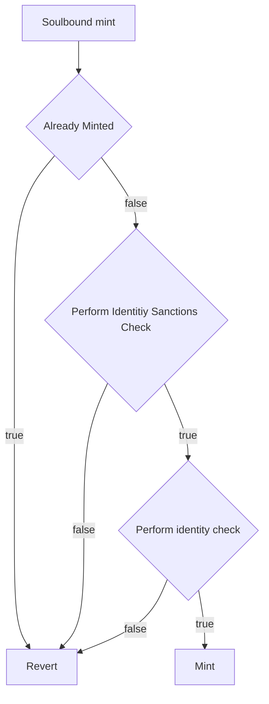

**Genesis Sequencer Sale**
Addresses / Entities that have been prescreened to take part in the Sale + have acquired a Genesis sequencer soulbound token can purchase 5 Sequencers. This is not up to 5 sequencers, but an absolute amount.

They are expected to trade a fixed price in ETH in exchange for 5 \* TOKEN_LOT_SIZE Aztec Tokens - this price is denoted as pricePerLot in the smart contract.

However; these tokens are not directly transfered to the user, instead they mint an Aztec Token Position (ATP).

- It has a beneficiary who will receive the funds it contains.
- These funds face a global lockup, and cannot be transfered.
- The tokens can be used in either staking or governance before the tokens are unlocked, but after some specified time.

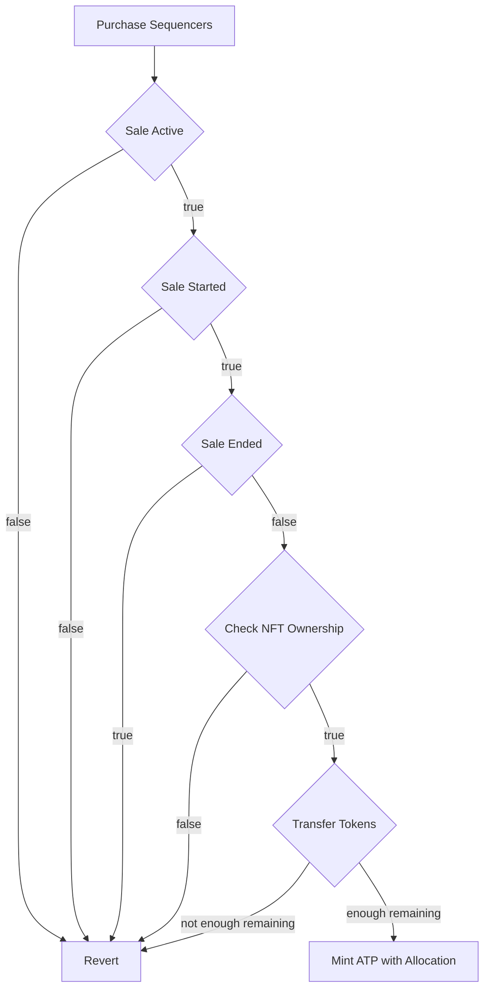

_Why are we using Non Claimable ATPs_
Operators who take part in the Sale are held to specific terms, so in exchange they MUST stake the purchased tokens. If they do not perform the stake operation, they cannot withdraw. Linear ATPs do not have this restriction.

While the token position is subject to lockup, the underlying tokens that can be used for staking and governance via the ATP Staking Extension, but for nothing else, once claimable, ATPs operate as a normal vesting contract, where beneficiaries can pull vested funds according to the unlock schedule. 

# Token Vaults

## Introduction

In this section, we will try to introduce the intentions of the system at a high level.
We will be talking about Aztec Token Positions (referred to as ATPs / Token Vaults), and how they are used to distribute Aztec tokens to individuals.

In particular, we will go through the different variants that exists, and the different properties that they have.
The variants are:

- Milestone Aztec Token Position (MATP)
  - Revokable
- Linear Aztec Token Position (LATP)
  - Non-revokable
  - Revokable
- Non Claimable Aztec Token Positions (NCATPs)
  - Revokable
  - Non Claimable

The variants have their intentions in common, they exist to:

1. Distribute tokens to beneficiaries (individuals, companies, etc.)
2. Force some form of global lockup, to ensure that the tokens are not transferrable immediately
3. Provide a mechanism for the beneficiary (the recipient of the tokens) to use at least some portion of their tokens in staking or governance **before** the tokens are unlocked but **after** some specified time.
4. Provide a mechanism for the Factory Owner to revoke the ATP in case of misconduct, and claw back the tokens that have not yet been `accumulated`

With the most important being 1 and 2.

## Global Unlock Schedule

Common for both variants is that point 2 is enforced by the same global unlock schedule.

An unlock schedule is a curve that is specified by a starting time, a cliff and and end time.
The cliff can be 0, but the end time must be greater than the starting time.
A potential schedule could look like below, where we have a 12 month cliff, with a full duration of 24 months.
During the cliff, the amount of tokens unlocked is 0, but as soon as the cliff is passed, the amount of tokens unlocked would be as if there was no cliff and simply a linear curve from the start time to the end time.

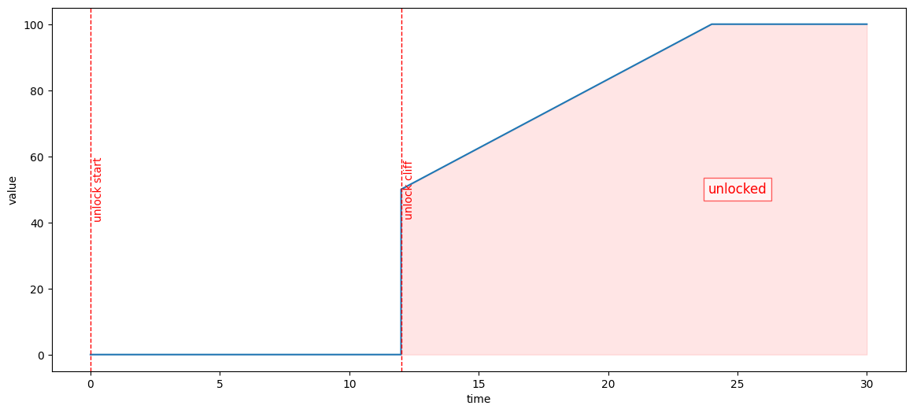

### Staking Locked Assets

Aztec (the network) needs a set of sequencers (staking the token) to produce blocks at a desirable rate and we rely on willing capital to flow into the network.
Since the network will be in its infancy it is decided, that it will be possible for ATPs, to use still-locked assets in certain approved operations under certain conditions - such as staking.

This means that an ATP will be be able to provide funds for a client to participate in block building.
With some caveats:

- Staking will only be allowed after some time.
- The ATP will have strict limitations on the action that can be taken with the funds, e.g., we must ensure that the operations cannot be used to bypass the unlock schedule.
- Revokable Linear ATPs may only use non-revokable assets, e.g., for an employee Alice this mean that she might be able to stake 10% of her allocation, as she have not yet accumulated more tokens. Further details on this will follow later.
  - This is to ensure that the ATP can be revoked, and that economic incentives are simpler to reason about. If Alice could use revokable assets, she might not care about avoiding slashing, if she knows she will be revoked anyway.

Beyond this, there is also a need for flexibility in the system because:

- The creation of the ATPs itself will happen at a time where the exact details around the start of the unlock schedule are not known, we need to be able to update the start of the unlock schedule.
- Aztec community might choose to deploy a new instance of the rollup (new version, think uniswap V1, V2, V3) we do not know about at the time of deployment of the ATPs. For this reason we do not know what the interfaces are for staking etc. and we need some method to add more operations to the ATPs after they were already created.

To support this, each ATP, be it Milestone or Linear is paired with its own Staker contract.
The ATP responsibilities are limited to managing token ownership, plus management of the Staker contract and `approve`ing it to handle funds purely for staking and voting purposes.
The ATP is managed by the beneficiary, while the Staker is managed by an operator address.
This separation ensures the beneficiary deals with token ownership, while a separate operator wallet handles staking details such as attestation keys.

Aztec-labs will be responsible for maintaining a Registry (whitelist) of staker implementations, that can be used by the ATPs.
These must be vetted to ensure that assets cannot bypass the unlock schedule by using the staker implementations.

To perform any staking operation, the ATP first `approve`s its Staker in the `TOKEN` contract.
The `operator` address, who manages the Staker, can then trigger e.g. a `stake` call on the Staker that pulls tokens from the ATP and places them in the Rollup Staking contract.

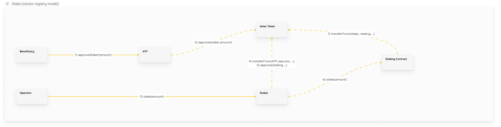

Since the Staking interface is subject to change, the Staker contract is upgradeable using an [ERC1967 proxy](https://docs.openzeppelin.com/contracts/5.x/api/proxy#ERC1967Proxy).
The beneficiary can call into the ATP, which in turn upgrades the Staker.
The implementation address is required to be previously whitelisted by the Owner (often Governance), to guard against malicious Staker contracts.

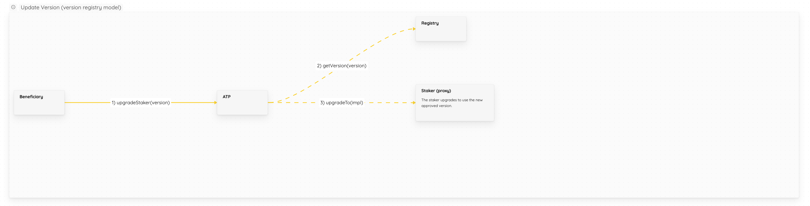

Unstaking is triggered by the operator via a call to the Staker.
The Staker implementation, having been vetted by both Aztec and the beneficiary, immediately sends the unstaked funds back to the ATP contract.

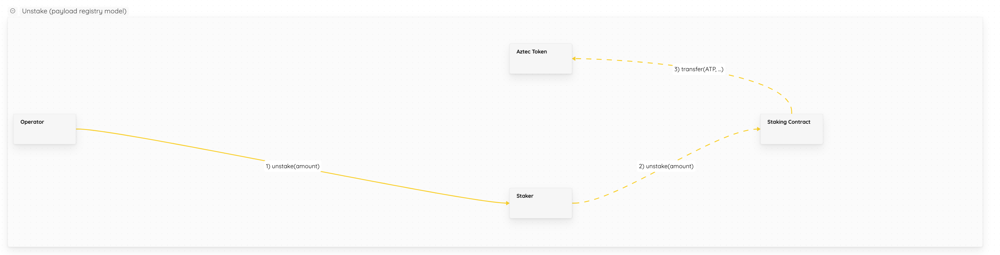

### Clawing Back

For the variants that are revokable, there is a `revoker` entity that can revoke the ATP, and claw back the tokens that have not yet been `accumulated`.
We will go more into detail on this in the next sections for the specific variants.
The main important property to remember, is that the `revoker` is specified by the same registry that we use to keep track of the `staker` implementations.

## Milestone Aztec Token Position (MATP)

In the Milestone Aztec Token Position (MATP), the beneficiary will receive a revokable ATP, which follows exactly **one** milestone.

A milestone is some event that is desired to happen (e.g. "launching mainnet")

The milestone is identified by an id, and a status, which can be one of:

- Pending: The milestone is still pending, and has not yet happened.
- Succeeded: The milestone has happened.
- Failed: The milestone has failed to happen.

Failed could for example happen if there is a deadline for the event, or there is some big failure.

When the milestone is marked as succeeded, the assets can be claimed (as long as the unlock allows it).
Before this, the assets cannot be claimed, but can however be used fully in staking and voting.

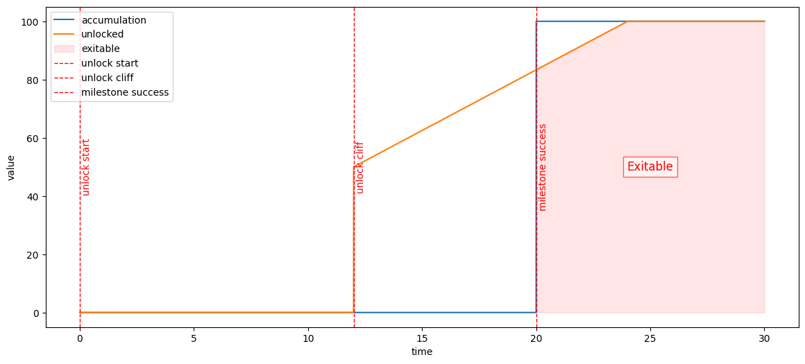

If the ATP is revoked, the `revoker` entity takes over both the ATP and the staker.
From the ATP's perspective, its beneficiary and operator are simply updated.

By taking control of both the operator and beneficiary roles, the revoker can directly unstake any assets that have been staked elsewhere.
While this may create significant overhead for the revoker, revocation is primarily intended as a punishment, with token clawback being a secondary consideration that was deemed acceptable.

If the milestone is marked as failed the effect is the as if the MATP was revoked.

Having this "all of nothing" approach when revoking the ATP was chosen to make accounting simpler, as there is no partial revoke.

A side-effect is that for an entity with multiple milestones, they will need multiple MATPs.

> [!NOTE]  
> The beneficiary of the MATP completely trusts Aztec-labs to correctly update the milestone status, and to not revoke maliciously.

## Linear Aztec Token Position (LATP)

As mentioned earlier, the Linear Aztec Token Position, exists in both a revokable and non-revokable variant.

The non-revokable variant simply follows the global unlock, and the beneficiary can use the entire allocation in staking from the start.
Following the same global schedule as earlier, it would look like below.

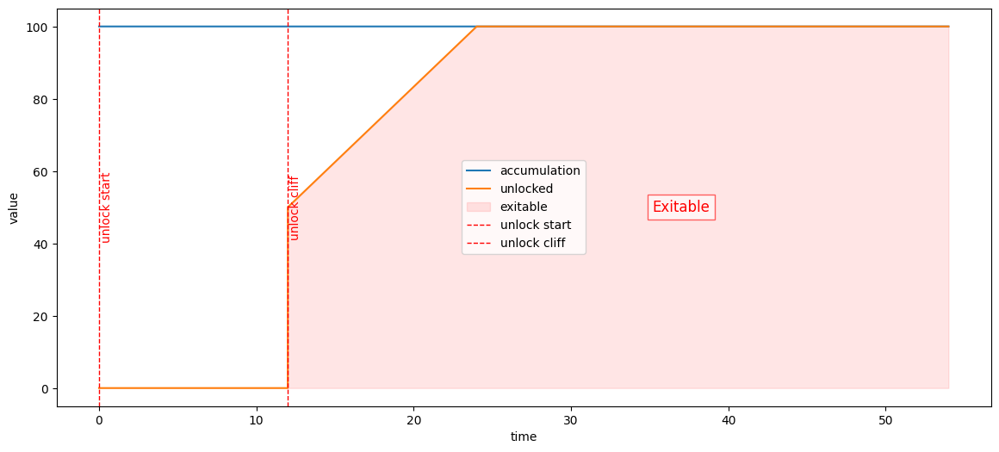

### Revokable LATP

For the revokable variant, there will be a second accumulation curve, which will be used to accumulate the tokens that have been used in staking.
This accumulation curve is independent from the global unlock schedule, and is specific to the individual ATP.
Below we have made a figure to illustrate the double curves.
In the figure, we are looking at a fictional employee "Alice", who started working for the company 6 months after the global unlock schedule started and have a 4 year linear accumulation with a 1 year cliff.

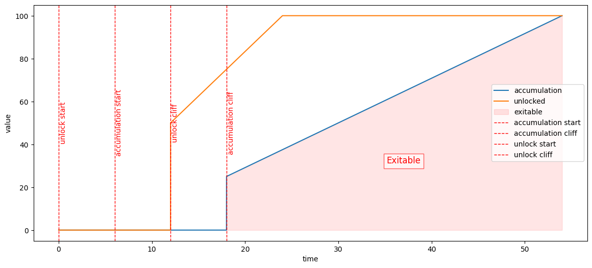

In the case where Alice does something that is against the rules (tbd), the part of the allocation that she have not yet accumulated is revoked.
This is the section from the blue line at current time, up to 100, e.g., if revoked before the accumulation cliff the entire allocation is revoked, and Alice get 0 tokens.
If revoked at the cliff, Alice will get ~25 tokens and so on.

An alternative curve could be with much faster accumulation, say 12 months with a 6 month cliff.
Considering the figure below, we can see how Alice might have earned more tokens due to her faster accumulation, but at the same time she is unable to claim them due to the global unlock schedule.

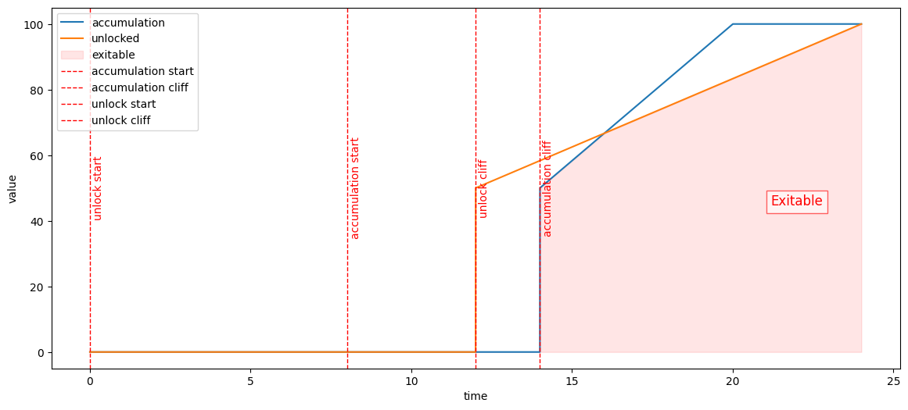

The sections marked `exitable` is the amount that can be claimed (exited), and it is the minimum of the global unlock and the accumulation curve.

> [!NOTE]  
> The beneficiary of the revokable LATP have ownership of their accumulated tokens, but trusts Aztec-labs not to revoke still accumulating tokens maliciously.

**ATP Staking Extension**
As the genesis sale participants will receive ATPS, as they are expected to stake, we need to make it possible for the ATP holders to actually stake the tokens which they hold.

Each ATP is paired with its own Staker contract whose implementations are managed by the Registry. The ATP is managed by the beneficiary, while it can set it's Staker can be managed by an operator address.
The implementations of the Staker contracts are managed by a Registry of staker implementations (this whitelist is maintained by the Factory Owner (often ZeroAddress / Governance)).


It is expected that participants who take part in the Genesis Sequencer Sale are agreeing to run a node on the network when it launches. This may be before there is a liquid market for the Aztec Token, and so it is important that the Staker implementation controls the flow of funds.
The first Staker implementation in this repository is a `NonClaimableAndWithdrawableStaker`. This allows ATP holders to stake, exit but not claim their funds unless they have staked.

The below diagram shows the upgrade flow for the ATPs.


Unstaking looks like as follows:


**Before an ATP is able to stake the following must occur**
The owner of the ATP registry must register the staker implementation

```sol
// Will result in staker version 1
atpRegistry.registerStakerImplementation(address(nonWithdrawableStaker));
// Will result in staker version 2
atpRegistry.registerStakerImplementation(address(withdrawableStaker));
```

This will allow the ATP operator to set their staker version.

```sol
atp.upgradeStaker(_version);
```

Once this is complete they can call

```sol
atp.approveStaker(_amount);
```

Only then will they be able to begin calling methods on the staker implementation.

### Function on the staking extension

**Staking Registry**
Users who run their own aztec nodes will be able to stake to them directly. However, we do not expect all people who take part in the NodeSale or in the later Auction to run their own nodes.

The Aztec system does NOT support delegated proof of stake as a first class primitive. However we do want to offer a place where purchasers of tokens can delegate staking operations of their node to a third party.

One way do to this would be build a stake delegation system off chain, but we have made a decision to run it through smart contracts.

The `StakingRegistry` allows any user to register themselves as a staking operator.
Once they have done this they will be able to list sets of keypairs that can be used as the _attester_ address (as well as a BLS key pair) on the behalf of users.

They will also be able to list the take rate they will expect for performing these duties on behalf of the user.

The expected end product will have a dashboard, listing known operators - people who have self registered and provided their address to the foundation. This will make the link between the `providerIdentifier` and their associationed operator brand. User's should not have to perform this duty themselves.

When user's initiate a deposit with a provider, a [0xSplits](https://docs.splits.org/core/split-v2) Pull Splitter contract will be deployed managing the user's fee recipient with the provider's fee recipient.

The provider is expected to honour this split contract, and set it as the coinbase in the node they are running on behalf of the users.

### Flow chart for staking via a provider

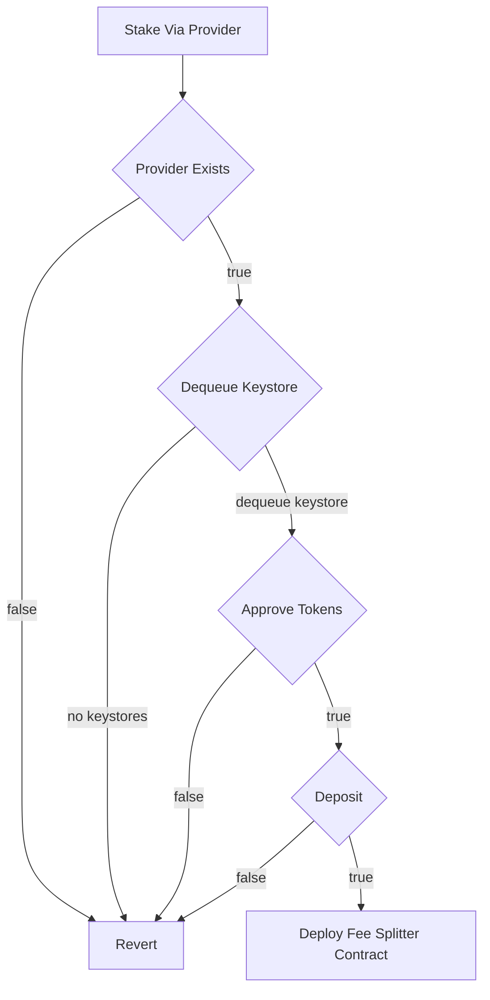

## Sale Invariants

- One soulbound token = one purchase of 5 validators - an address should never be able to mint more, regardless of setting multiple different beneficiary addresses
- One beneficiary = one ATP

## Sale Notes

- For the Token Sale, the amount of tokens to be sold must be transferred to the contract BEFORE the sale starts.
- The deployed aztec token has the foundation in the mint role, and thus the foundation can mint or transfer the tokens into the sale.
- For the Token Sale, the owner must be able to recover the eth raised from the sale. And recover any unsold tokens from the sale contract.

## Uniswap Liquidity Launcher and Continuous Clearing Auction

To perform the contributor + public portions of the sale, we worked with Uniswap to develop their Liquidity Launcher and CCA auction.

During the auction, the Auction Hook will allow genesis + contributor track NFT holders to place bids for the first portion of the sale, and public track holders to bid afterwards. It also enforces per soulbound purchase limits.

## General Contract Interactions Diagram
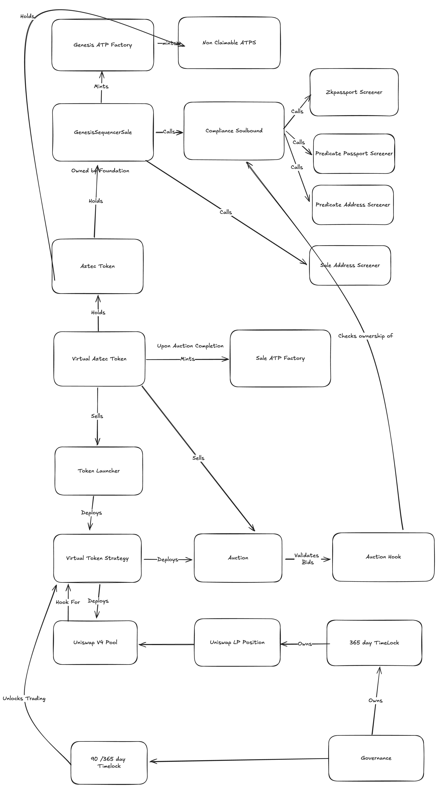

## The Auction Supply Schedule
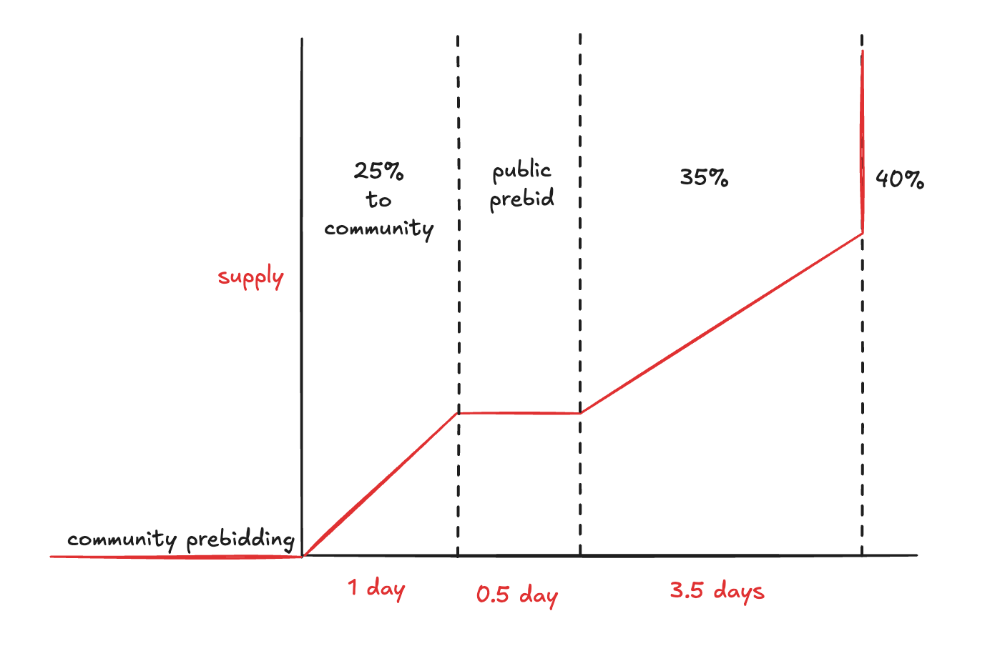
The supply schedule allows the community to prebid before the auction begins clearing. This gives participants time to get familiar with the mechanism, and decide how to bid. That being said, there is no supply released during pre-bidding, so we do not expect people to bid until the very end. 

25% will clear to exclusively genesis and contirbutor bidders. With unsold tokens being returned to the foundation.

There is a 12 hour prebidding period for public. This allows public track participants that bid within that period to all get the same price. Sniping won't work here!

The auction ends with 3.5 days of a 10% per day linear release.

There is a 40% cliff at the end to prevent final clearing price manipulation. ( People bid over the remaining supply, so more supply at the end would have a much larger impact on clearing price - you do not want this to be extreme as it will mean more raised currency must be used for the pool ).

## The liquidity pool
After the auctions conclusion - 15% of the total aztec tokens placed into the auction system will go into a uniswap v4 pool - paired with the eth raised at the discovered clearing price.

This pool has a beforeTrading hook that will not be active until Governance vote to enable it. Once enabled - Gov cannot disable trading.

Ownership of the pool is held by a `GovernanceAcceleratedLock` (which is in turn owned by Governance). Come 90 days from the sales beginning, Governacne can activate trading on the pool by accelerating this lock, then triggering the boolean.

## Implementation Notes

**External Dependencies**

**Aztec Rollup Contracts**
- https://github.com/AztecProtocol/l1-contracts at commit: 4da96e677b085fe529343fba33b82772c0bb1d4e
**OZ**
- https://github.com/OpenZeppelin/openzeppelin-contracts at release https://github.com/OpenZeppelin/openzeppelin-contracts/blob/release-v5.3/CHANGELOG.md commit: e4f70216d759d8e6a64144a9e1f7bbeed78e7079
**Uniswap Liquidity Launcher / CCA**
- https://github.com/Uniswap/liquidity-launcher at release https://github.com/Uniswap/liquidity-launcher/releases/tag/v1.0.0-candidate
**ZK Passport**
- https://github.com/zkpassport/zkpassport-packages at commit: 210c8653cfda0253957745645eaab9663c128ca8
- https://github.com/zkpassport/circuits at commit: 24537062043212a73f70066f2e04bc0abe97ae0e
**Predicate V1**
- https://github.com/PredicateLabs/predicate-contracts at commit: 07e43693a69301c8e986dc51ca59dc6c19e7b5f3

**Ignition**
- The Virtual Aztec Token has an unorthadox structure, it was created to allow creation of Token Vaults from the CCA system.
    - It's Ownable only to be able to set the Auction / Strategy contracts during deployment - ownership should be revoked as soon as these are set successfully.
- Soulbound minters should take care to validate that they are minting for their highest privilage. As once they have minted they will not be able to upgrade their token.

**Token Vaults**
- The structure of the ATPs might be slightly unorthodox, as there is an abstract `Core` with the mutable logic, and the higher level which adds some additional `view` functions.
- We use a factory and clones to reduce the cost of the deploying the ATPs.
- The `ATPFactory` implements a `minter` role-based access control system:
  - The factory `owner` can designate multiple addresses as `minter`s via the `setMinter(address, bool)` function.
  - Only addresses with the `minter` role can create ATPs (LATP, NCATP, MATP) through the factory.
  - The factory `owner` is automatically granted the `minter` role upon deployment.
  - This separation of concerns allows multiple trusted addresses to mint ATPs without requiring full ownership privileges over the factory.
  - The `owner` retains exclusive control over administrative functions like token recovery and minter management.
- Since the `Staker` is a proxy there was a risk of self-destructing the implementation or proxy. However, since the cancun fork [EIP-6780](https://github.com/ethereum/EIPs/blob/master/EIPS/eip-6780.md) made self-destruct only possible to use in the same transaction as in which the contract was created.
- We add a `rescueFunds` function to the `ATP` contract to allow the `beneficiary` to rescue funds that are not Aztec tokens from the contract. @LHerskind has PTSD from seeing people throw funds at the wrong contract, and we want to avoid that.
- There are currently no "real" `staker` implementations, but only the no-op and the ones used for testing.
- The `Aztec` token contract is as of now a simple `Ownable` `ERC20` contract from OpenZeppelin that allows the `owner` to mint tokens.
  - We expect aztec foundation to be the owner of the token contract shortterm.
- The `Registry` is essentially the "source of truth" for values shared across the ATP's, it is ownable.
  - The maps of allowed values are append only to ensure that values that were valid at time `t` are still valid at time `t+1`.
  - Timebased values can only be decreased from their initial values. This is to ensure that tokens that could have been claimed are not suddenly locked.
  - Depending on the usecase we expect Governance / Aztec Labs / Aztec Foundation to be the owner of the registry.
- The staker implementations MUST be made such that they cannot be used to bypass the unlock schedules.

## Implementation Notes

## Threat Model and Known Issues

**Token Vaults**
Our system consist of a few actors with different powers, lets reiterate them:

- The `operator`: the actor of an ATP that can execute operations on the staker
- The `beneficiary`: the recipient of an ATP, and functionally its owner
  - Can update the `operator`, update stakers, approve staker etc
- The `FactoryOwner`: the actor that owns the ATP factory
  - Can grant or revoke `minter` privileges via `setMinter(address, bool)`
  - Can recover tokens from the factory via `recoverTokens`
  - Has the `minter` role by default upon deployment
- The `minter`: an actor with privileges to create ATPs through the factory
  - Can create LATP, NCATP, and MATP instances
  - Multiple addresses can hold the `minter` role simultaneously
- The `RegistryOwner`: the actor that owns the registry
  - Can add new staker implementations, update the `revoker`, update the time where staking is allowed, update the start of the global unlock schedule etc
- The `revoker`: the actor that can revoke and claw back the tokens of revokable ATPs
- The `revokerOperator`: the actor that can operate the staker after an atp have been revoked

### Acceptable Threats

**Token Vaults**
The following are threats that have been deemed acceptable.

- If a `minter` is malicious:
  - They can create unauthorized ATPs and allocate tokens from the factory's balance to arbitrary beneficiaries.
  - This requires the factory to be pre-funded with tokens, and the malicious minter must have been granted the role by the `FactoryOwner`.
  - The `FactoryOwner` should only grant `minter` privileges to trusted addresses and can revoke the role at any time via `setMinter(address, false)`.
- If the `FactoryOwner` is malicious:
  - They can grant `minter` privileges to malicious actors.
  - They can recover any tokens held by the factory via `recoverTokens`.
- If the `revoker` is malicious:
  - He can steal the funds that are not yet `accumulated` in revokable LATPs.
  - He can steal the funds of non-succeeded milestoke ATPs (only unstaked if not also controlling the `revokerOperator`).
- If the `RegistryOwner` is malicious, he might add a bad staker implementation, to steal staked funds, but the `beneficiary` will need to execute it for it to work. Alternatively, the `RegistryOwner` might simply never add a staker implementation, and then it is just good ol' unlocking.
- If the `RegistryOwner` and the `beneficiary` collude, they can add a staker implementation that will allow the `beneficiary` to claim all tokens from the ATP bypassing the locks.

**Ignition**
- Predicate can issue attestations, and therefore are a critical component. The sale cannot run if they go down, and the sanctions checks will not be enforced effectively if they are rogue.


### Known Issues

- Spreading a beneficiary's allocation across multiple `MATP`s could mean each individual MATP allocation ends up below the minimum staking threshold, even if the total beneficiary allocation combined across their `MATP`s would be enough to participate. This can be worked around by introducing an intermediate LST-like staking contract that aggregates funds across the beneficiary's `MATP`s.
- From the requirements _The address to which the tokens are revoked to is specified at deployment of the ATP_ and _For milestone ATPs, `revoke` takes over the ownership of the ATP_, it seems to be implied that the address that takes control of the ownership of a MATP upon a `revoke`, or at least the one that can extract the tokens after gaining control, must be specified at deployment time. However, in the current implementation this address is the `revoker`, which is set globally in the Registry and updateable by the Registry's owner.
  - @aminsammara have specified that the requirement was relevant for the LATP
- Any additional tokens transferred to the `ATP` after its creation might not be retriavable until after the global lock ends.
  - They can be retireved if not bounded by the global lock.
- Failing a milestone and `revoke`ing all `MATP`s for that milestone are not exactly equivalent actions when it comes to operating the `staker` contract.
- Duplicate code in `LATP` and `MATP`, and `LATPCore` and `MATPCore`, could be extracted to common base classes.
- The `linearStakerImplementations`, `milestoneStakerImplementations`, and `milestones` mappings in the `Registry`, along with their respective `next` pointers, could be rewritten as dynamic arrays for simplicity.
- Missing natspec comments in `BaseStaker`s, `MATP`-related methods of the `ATPFactory`, milestone-related methods of `Registry`, and a few others.
- Stakers cannot delegate their vote if they are automatically following rollups.

## Foundry
### Prerequisites

- Foundry installed
- Node & yarn installed for merkle tree utilities
- Cargo installed to run uniswap address miner

We are using foundry as our main testing framework.
This means that you can use all the usual `forge` commands for testing.

```shell
bootstrap.sh build # builds all components
forge test         # runs the tests
forge coverage     # runs the tests and generates a coverage report (optional --report lcov)
                   # `bootstrap.sh coverage` is also an option
```

Tests are written in the `test` folder, and contain a folder using the Branching Tree Technique (BTT) for some initial unit tests.

This it to be extended with more extensive integration tests and fuzzing.

To avoid the test files bloating coverage, you can add an empty `test()` function to the files.

```solidity
function test() external virtual {
    // @dev To avoid this being included in the coverage results
    // https://github.com/foundry-rs/foundry/issues/2988#issuecomment-1437784542
    // If you are using this to check coverage, you can simply remove this function.
}
```

We use the btt testing technique, see https://github.com/PaulRBerg/btt-examples for more information, we recommend installing the bulloak tool https://github.com/alexfertel/bulloak to assist in test generation.


## Slither

We are using slither to run static analysis on the code.

For any warning/issue found by the tool, they shall either be fixed, or a comment describing why it is not a problem added to the code in place.

This should ensure that we can run slither as part of CI with a failure if any issues are found (`--fail-pedantic `).

To run slither we are using the [ethereum security toolbox](https://github.com/trailofbits/eth-security-toolbox) from Trail of Bits.
We are using their docker image to set it all up, simply run the script to build and run the slither command.

```shell
./shell-scripts/run-slither.sh # run slither, pass any additional arguments to the script
```

### Format

```shell
$ forge fmt
```

### Gas Snapshots

```shell
$ forge snapshot
```

### Linting

We use solhint

```
yarn lint
```

---


### Comment on slither

Unclear exactly why, but there seems to be an issue with slither and the structure that means that it believes that every single storage variable should be constant and that most things are uninitialized.
For this reason we are currently stopping it from being a blocker in the CI.

A snippet is inserted below. With the current code 😬. Also there are some known issues with slither and the new `require(bool, error)` syntax supported by `0.8.27`.

```bash
INFO:Detectors:
ATPCore.allocation (src/atp/ATPCore.sol#36) should be constant
ATPCore.beneficiary (src/atp/ATPCore.sol#37) should be constant
ATPCore.claimed (src/atp/ATPCore.sol#40) should be constant
ATPCore.executor (src/atp/ATPCore.sol#38) should be constant
ATPCoreCov.allocation (src/atp/coverage/ATPCore_cov.sol#40) should be constant
ATPCoreCov.beneficiary (src/atp/coverage/ATPCore_cov.sol#41) should be constant
ATPCoreCov.claimed (src/atp/coverage/ATPCore_cov.sol#44) should be constant
ATPCoreCov.executor (src/atp/coverage/ATPCore_cov.sol#42) should be constant
PayloadRegistry.executeAllowedAt (src/PayloadRegistry.sol#36) should be constant
PayloadRegistry.revoker (src/PayloadRegistry.sol#37) should be constant
PayloadRegistry.unlockStartTime (src/PayloadRegistry.sol#35) should be constant
Reference: https://github.com/crytic/slither/wiki/Detector-Documentation#state-variables-that-could-be-declared-constant
INFO:Slither:. analyzed (44 contracts with 92 detectors), 25 result(s) found
```

## Relevant links to functions in the l1 rollup contracts

The Core rollup contracts are divided up into libraries which can make finding their functions hard. Here I have included a list of call sites to help you find them.

**rollup.deposit**

- https://github.com/AztecProtocol/aztec-packages/blob/880075b0284c0c6098013473c0593966397335b5/l1-contracts/src/core/RollupCore.sol#L407
- which calls: https://github.com/AztecProtocol/aztec-packages/blob/880075b0284c0c6098013473c0593966397335b5/l1-contracts/src/core/libraries/rollup/ValidatorOperationsExtLib.sol#L40
- which calls: https://github.com/AztecProtocol/aztec-packages/blob/880075b0284c0c6098013473c0593966397335b5/l1-contracts/src/core/libraries/rollup/StakingLib.sol#L269

This will add a validator into the Queue.
This queue drips here
https://github.com/AztecProtocol/aztec-packages/blob/880075b0284c0c6098013473c0593966397335b5/l1-contracts/src/core/libraries/rollup/StakingLib.sol#L316

**rollup.claimSequencerRewards**

- https://github.com/AztecProtocol/aztec-packages/blob/880075b0284c0c6098013473c0593966397335b5/l1-contracts/src/core/RollupCore.sol#L365
- which calls: https://github.com/AztecProtocol/aztec-packages/blob/880075b0284c0c6098013473c0593966397335b5/l1-contracts/src/core/libraries/rollup/RewardLib.sol#L84

**rollup.delegate**

- https://github.com/AztecProtocol/aztec-packages/blob/880075b0284c0c6098013473c0593966397335b5/l1-contracts/src/governance/GSE.sol#L499
- which calls: https://github.com/AztecProtocol/aztec-packages/blob/880075b0284c0c6098013473c0593966397335b5/l1-contracts/src/governance/libraries/DepositDelegationLib.sol#L140

**rollup.initiateWithdraw**

- https://github.com/AztecProtocol/aztec-packages/blob/880075b0284c0c6098013473c0593966397335b5/l1-contracts/src/core/RollupCore.sol#L437
- which calls: https://github.com/AztecProtocol/aztec-packages/blob/880075b0284c0c6098013473c0593966397335b5/l1-contracts/src/core/libraries/rollup/ValidatorOperationsExtLib.sol#L57
- which calls: https://github.com/AztecProtocol/aztec-packages/blob/880075b0284c0c6098013473c0593966397335b5/l1-contracts/src/core/libraries/rollup/StakingLib.sol#L382

**rollup.finializeWithdraw**

- https://github.com/AztecProtocol/aztec-packages/blob/880075b0284c0c6098013473c0593966397335b5/l1-contracts/src/core/RollupCore.sol#L446
- which calls: https://github.com/AztecProtocol/aztec-packages/blob/880075b0284c0c6098013473c0593966397335b5/l1-contracts/src/core/libraries/rollup/ValidatorOperationsExtLib.sol#L61
- which calls: https://github.com/AztecProtocol/aztec-packages/blob/880075b0284c0c6098013473c0593966397335b5/l1-contracts/src/core/libraries/rollup/StakingLib.sol#L170

**Known issues with the Staking Registry**

- Anybody can take a `providerId`, so we are relying on operators to self register, then send the staking dashboard maintainers their operatorId before we would show them on the front end. (This will likely be maintained via a public version control system).
- The onus is on the stakingProvider to register correct key pairs. We do not check that they are valid, depositing into the rollup WILL fail if they are not valid or if they are duplicates. This failure will not take place immediately, but rather whenever the rollup entry queue has finished.
- The game theory on node operators setting the coinbase address correctly relies on users being easily able to swap to other providers if somebody is misbehaving. There is no incentive to operators other than reputation, to not steal user's rewards / or get them slashed. Users should trust their operators, just because they are listed on some frontend does not mean that they are honest.
- If a validator provider registers an attestation key that already exists in the set, then we will not find out until the queue attempts to enter the validator - which will be some time after the deposit took place. This will cause the deposit to revert, but the user will maintain the funds, as they will return to the stated withdrawal address.
